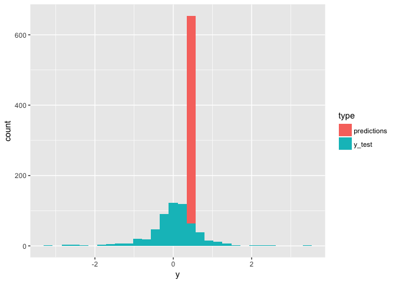

Movie Data
================
Pete Mohanty

``` r
library(kerasformula)
library(ggplot2)

movies <- read.csv("http://s3.amazonaws.com/dcwoods2717/movies.csv")
dplyr::glimpse(movies)
```

    Observations: 2,961
    Variables: 11
    $ title               <fct> Over the Hill to the Poorhouse, The Broadw...
    $ genre               <fct> Crime, Musical, Comedy, Comedy, Comedy, An...
    $ director            <fct> Harry F. Millarde, Harry Beaumont, Lloyd B...
    $ year                <int> 1920, 1929, 1933, 1935, 1936, 1937, 1939, ...
    $ duration            <int> 110, 100, 89, 81, 87, 83, 102, 226, 88, 14...
    $ gross               <int> 3000000, 2808000, 2300000, 3000000, 163245...
    $ budget              <int> 100000, 379000, 439000, 609000, 1500000, 2...
    $ cast_facebook_likes <int> 4, 109, 995, 824, 352, 229, 2509, 1862, 11...
    $ votes               <int> 5, 4546, 7921, 13269, 143086, 133348, 2918...
    $ reviews             <int> 2, 107, 162, 164, 331, 349, 746, 863, 252,...
    $ rating              <dbl> 4.8, 6.3, 7.7, 7.8, 8.6, 7.7, 8.1, 8.2, 7....

Predicting Profitability
------------------------

Suppose we are interested in revenue relative to budget... Since `y = log10(gross/budget)`, `y = 0` means "break even."  Let's predict `log10(gross/budget)`. The logged data look approximately normal.

``` r
f <- formula(log10(gross/budget) ~ . -genre -director -title)
P <- ncol(model.matrix(f, movies))
out <- kms(f, movies, seed=1234, batch_size = 1)
```

    ___________________________________________________________________________
    Layer (type)                     Output Shape                  Param #     
    ===========================================================================
    dense_1 (Dense)                  (None, 256)                   1792        
    ___________________________________________________________________________
    dropout_1 (Dropout)              (None, 256)                   0           
    ___________________________________________________________________________
    dense_2 (Dense)                  (None, 128)                   32896       
    ___________________________________________________________________________
    dropout_2 (Dropout)              (None, 128)                   0           
    ___________________________________________________________________________
    dense_3 (Dense)                  (None, 1)                     129         
    ===========================================================================
    Total params: 34,817
    Trainable params: 34,817
    Non-trainable params: 0
    ___________________________________________________________________________

``` r
out$MAE_predictions
```

    [1] 0.0610874

``` r
out$R2_predictions
```

                 [,1]
    [1,] 0.0002374606

``` r
est <- data.frame(y = c(out$y_test, out$predictions),
           type = c(rep("y_test", length(out$y_test)), rep("predictions", length(out$predictions))))
ggplot(est, aes(x=y, fill=type)) + geom_histogram()
```



``` r
library(polyreg)
xy <- cbind(movies[,c(4:5, 8:11)])
xy <- cbind(xy, log10(movies$gross/movies$budget))
xval.out <- xvalPoly(xy, maxDeg = 3, maxInteractDeg = 2)
```

    getPoly time in xvalPoly:  0.191 0.017 0.209 0 0 
    lm() time:  0.003 0 0.003 0 0 
    accuracy:  0.4215593 
    lm() time:  0.006 0 0.006 0 0 
    accuracy:  0.4219541 
    lm() time:  0.026 0.001 0.028 0 0 
    accuracy:  0.4138015 

``` r
xval.out
```

    [1] 0.4215593 0.4219541 0.4138015
